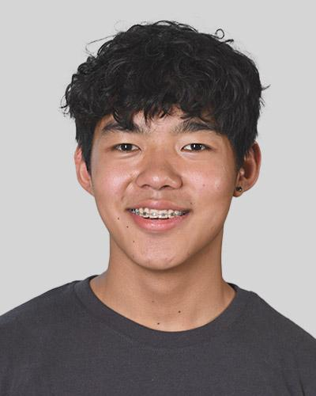

# Tenzin Tsering Tünschitsang





## Kurze Biographie

Ich bin Tenzin, 17 Jahre alt, und lerne in Richtung Applikationsentwicklung in der Informatik, da ich schon immer wusste, dass ich mich mit Technik beschäftigen möchte. Als kleines Kind war ich neugierig darauf, wie ferngesteuerte Autos funktionieren.

### Mein Bildungsweg

- 2023: Beginn meiner Ausbildung an der IMS (Informatikmittelschule)

### Mein Motto

> "Wenn jemand anders es schaffen kann, warum sollte ich es nicht schaffen?"


## Sprachen, die ich spreche

- Tibetisch
- Deutsch
- Englisch
- Französisch (Schulkenntnisse)

## Social Media Profile

- [Instagram](https://www.instagram.com/ten_.05/)

## "Hallo Welt" in meiner Lieblingssprache

Es ist nicht so, dass die Programmiersprache C meine Lieblingsprogrammiersprache ist, sondern dass ich keine andere kann.

```c
#include <stdio.h>
int main() {
    printf("Hallo Welt!");

    return 0;
}
